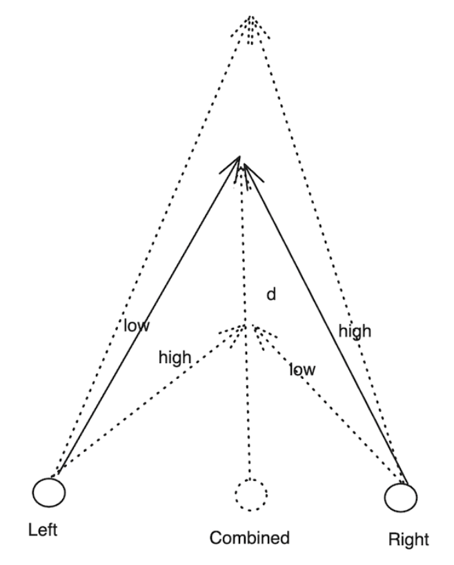

# Some Info about Gaze
Gaze inference uses Aria's Eye Tracking (ET) camera images to estimate the direction the user is looking. This eye gaze estimation is in Central Pupil Frame (CPF).

# References
1. [Eye Gaze](https://facebookresearch.github.io/projectaria_tools/docs/data_formats/mps/mps_eye_gaze)
2. [In-session Gaze Calibration](https://facebookresearch.github.io/projectaria_tools/docs/ARK/mps/eye_gaze_calibration)
3. [`projectaria_eyetracking` GitHub link.](https://github.com/facebookresearch/projectaria_eyetracking)
4. [Eye Gaze Code Snippets](https://facebookresearch.github.io/projectaria_tools/docs/data_utilities/core_code_snippets/eye_gaze_code)